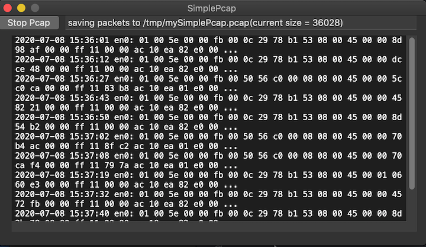

# SimplePcap

This sample code is associated with my blog post [macOS vs. Windows - What the kernels tell you about security events: Part 2](https://www.elastic.co/blog/macos-windows-what-kernels-tell-you-about-security-events-part-2). It demonstrates the use of [NEFilterPacketProvider](https://developer.apple.com/documentation/networkextension/nefilterpacketprovider?language=objc) class of Apple's [Content Filter](https://developer.apple.com/documentation/networkextension/content_filter_providers?language=objc#topics) APIs announced in [WWDC 2019](https://developer.apple.com/videos/play/wwdc2019/714). The pcap capture demonstrated in this sample code is useful to debug your own Content Filter. This sample code project only runs on macOS. When the network extension in the sample is correctly built and run, it automatically generate a `mytest.pcap` file under `/tmp` folder. The pcap file captures all the network packets that go through your `NEFilterPacketProvider`.



## To clone this repo:
```
git clone git@github.com:Trinity2019/SimplePcap.git
```

## Build

The main purpose of this project is for demonstrating the usage of `NEFilterPacketProvider` class and enrich the online sample resources of [NetworkExtensions](https://developer.apple.com/documentation/networkextension?language=objc).  To be able to build, you need to 1. register as an Apple developer, 2. apply for [content-filter-provider entitlement](https://developer.apple.com/documentation/bundleresources/entitlements/com_apple_developer_networking_networkextension?language=objc) from Apple, 3. configure the projects correctly with information abtained from step 1. and 2.

